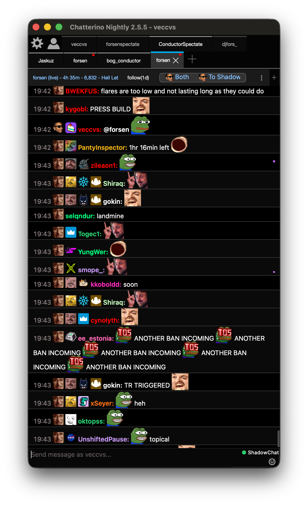
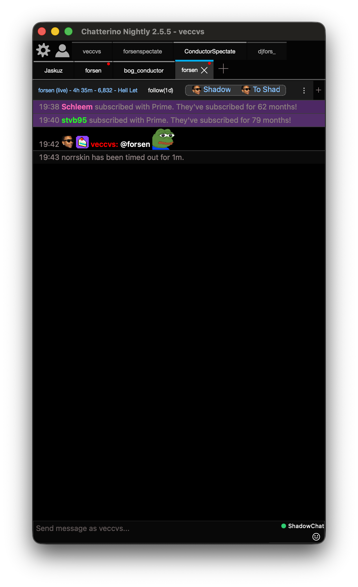

# Chatterino Shadow

**The Chatterino fork for people Twitch already kicked out of chat.**

A ban used to mean the tab goes dark, you swap to an alt, or you disappear into Discord. A timeout used to mean you can still watch, but you cannot talk. Chatterino Shadow keeps you on the account you always use, keeps the live channel open, and gives you a marked overlay — ShadowChat — so you can still talk with everyone else running this fork.

<p align="center">
  
</p>

<p align="center"><em>Both view: live Twitch chat and ShadowChat in one timeline. Sunglasses mark overlay lines. The green <strong>ShadowChat</strong> pill means the overlay is connected.</em></p>

## Why this exists

Twitch chat is the room. When you get banned, official clients throw you out of that room. Timed-out people can still read, but every send is a brick wall.

This fork is for that moment:

- You stay signed in as **you**. No anonymous `justinfan` in the UI. No alt.
- The channel **stays open** after a permanent ban. Live Twitch chat keeps scrolling.
- Hit send and it goes to **ShadowChat** by default — a public overlay for this fork, in that same channel. Twitch never carries those lines.
- Other people on this fork see you. Official Chatterino, the website, and mobile **never** do.

If you live in chat, a timeout should not mute you for the people who actually run this client. A ban should not mean you have to leave the stream.

## What banned and timed-out users get

### Keep the channel after a ban

Twitch will PART your account from IRC. Official clients treat that as “you do not belong here anymore.” Chatterino Shadow does not switch you to anonymous and does not close the split. A hidden read-only connection keeps feeding the same channel view, so the live chat, uptime, and viewer count stay on screen while the header still shows your usual login.

### Talk during a timeout

A timeout is supposed to be silence. Here the default send target is **To Shadow**, so you keep talking under your Twitch username — same color, same badges this client can still show — instead of dying as “you are timed out.” When the timeout ends, flip to **To Chat** if you want the next line on Twitch again.

### Stay on your real name

Shadow messages are not anonymous. The overlay authenticates your logged-in Twitch token and publishes under the login Twitch itself returns. People on this fork see `you`, not a throwaway nick.

### One timeline, or only the overlay

Default view is **Both**: Twitch lines and ShadowChat in one chronological list. Overlay lines carry a sunglasses badge so nobody confuses a shadow send with a Twitch send.

Click the header switcher to cycle:

| View | What you see |
| --- | --- |
| **Both** | Mixed Twitch + ShadowChat |
| **Chat** | Twitch only |
| **Shadow** | Overlay only (system notices still show) |

<p align="center">
  
</p>

<p align="center"><em>Shadow view after a timeout. The overlay stays in the same split — you do not open a second app to keep talking.</em></p>

### Choose where send goes

Next to the view switcher is the send target:

| Target | What send does |
| --- | --- |
| **To Shadow** | Always publish to the overlay (default) |
| **To Chat** | Send to Twitch as usual |

Replies to a shadow line stay in the overlay. Followers-only, unique-chat, and other non-ban refusals do **not** become shadow messages.

### Always know whether you are on the overlay

The input bar shows **ShadowChat** with a status dot:

- **Green** — connected
- **Yellow** — connecting
- **Red** — disconnected

If the overlay cannot take a send, you get a system line (`Couldn't send to shadow chat.`) instead of a fake Twitch success.

### Still Chatterino

Tabs, splits, 7TV / BTTV / FFZ emotes, filters, highlights, moderation tools, plugins — all the client you already know. Shadow lines are filterable with `flags.shadow`. This is not a separate chat app glued on the side.

## How it works

```
You hit send
        │
        ├─ To Shadow ──────────────────────────────► ShadowChat overlay
        │                                              (your Twitch name, marked)
        │
        └─ To Chat ─► Twitch Helix / IRC
                         │
                         ├─ accepted ──────────────► Twitch chat
                         └─ banned / timed out ────► Twitch refuses the send
                                                     (the split stays open)

Twitch PARTs you after a ban
        │
        └─ hidden ghost IRC JOINs as a reader ─────► same split keeps live chat
           (your visible account does not change)
```

### 1. You stay the signed-in account

Login is normal Chatterino Twitch login. The overlay never swaps the UI to anonymous to keep the tab alive.

### 2. After a ban, a ghost reader keeps the feed

When this client learns you are banned (self-PART, permanent-ban NOTICE, or a forbidden Helix send), it opens a second, hidden IRC connection that only **reads** that channel. Messages land in the same split you already have open. You still appear as yourself in the window title and input (`Send message as …`).

Timeouts do not need that ghost path: Twitch already lets you keep watching.

### 3. ShadowChat is a live overlay, not Twitch

Open channels subscribe to a ShadowChat relay over WebSocket. The client sends your existing Twitch OAuth token. The relay validates it with Twitch (`oauth2/validate`) and only then accepts the login name. Rooms are Twitch channel IDs. Official clients are not on this socket, so they never see overlay lines.

This cut is **live only**. There is no Discord-style history when you join late.

### 4. Sends are routed, not mirrored

- **To Shadow** publishes to the overlay immediately and draws a marked local line. This is the default, including while you are banned or timed out.
- **To Chat** goes to Twitch Helix/IRC like stock Chatterino. A ban or timeout then fails on Twitch; it does not quietly post into the overlay.
- Followers-only and similar rules stay Twitch failures. They do not dump into ShadowChat.

### 5. Overlay lines are marked

Every shadow message is flagged as overlay chat and gets the sunglasses **Shadow user** badge, plus whatever Twitch badges this client can still attach (including in a banned channel). **Both** mixes them with Twitch chat. **Chat** hides them. **Shadow** hides Twitch chat lines.

### 6. What Twitch moderation sees

Nothing on the overlay. ShadowChat does not post into Twitch IRC or Helix chat. It does not unban you on Twitch. It does not show your lines to people on the website, mobile, or stock Chatterino. It keeps a conversation going **inside this fork**, next to the live channel you were already watching.

## Install

Grab the latest builds from the [Nightly Release](https://github.com/veccv/chatterino2-shadow/releases/tag/nightly-build). These are unsigned GitHub artifacts, so Windows and macOS will warn you the first time. That is expected.

### Windows

1. Download **`Chatterino.Nightly.Installer.exe`**.
2. Run the installer. Windows SmartScreen will block it with **Windows protected your PC** because this fork is not a Microsoft-signed publisher.
3. Click **More info**, then **Run anyway**.
4. If User Account Control asks whether to allow an unknown publisher, click **Yes**.
5. Finish the installer. Optionally tick the VC++ runtime task if it is offered. If Chatterino still fails to start, install the [VC++ Redistributables](https://aka.ms/vs/17/release/vc_redist.x64.exe). If you get `MSVCR120.dll missing`, also install the [VC++ 2013 Redistributable](https://download.microsoft.com/download/2/E/6/2E61CFA4-993B-4DD4-91DA-3737CD5CD6E3/vcredist_x64.exe).

Portable option: download the `chatterino-windows-x86-64-….zip`, extract it, and run `chatterino.exe`. SmartScreen can still warn on the first launch — **More info** → **Run anyway**.

### macOS

The `.dmg` is not Apple-notarized, so Gatekeeper will refuse a normal double-click until you allow it once.

1. Download **`chatterino-macos-….dmg`** and open it.
2. Drag **chatterino** into **Applications**.
3. Do not double-click it yet. In Finder, go to **Applications**, **Control-click** (or right-click) **chatterino**, and choose **Open**.
4. In the dialog, click **Open**. macOS remembers this and later launches work as usual.

If macOS still says the app cannot be opened because the developer cannot be verified (common on macOS Sequoia and later):

1. Open **System Settings** → **Privacy & Security**.
2. Scroll to **Security**. You should see that chatterino was blocked.
3. Click **Open Anyway**, then confirm with your password or Touch ID.

Fallback from Terminal if the UI path is stuck:

```shell
xattr -cr /Applications/chatterino.app
open /Applications/chatterino.app
```

That clears the quarantine flag Apple attaches to downloads.

### Linux

Ubuntu 24.04 (and similar Debian-based systems):

1. Download **`Chatterino-ubuntu-24.04-x86_64.deb`**.
2. Install it:

```shell
sudo apt install ./Chatterino-ubuntu-24.04-x86_64.deb
```

If `apt` reports missing dependencies, run `sudo apt --fix-broken install` and try again. Then start **chatterino** from the app menu or `chatterino` in a terminal.

Other distros: there is no universal binary yet — [build from source](#building).

## Using it

1. [Install](#install) this fork and log in with your usual Twitch account.
2. Open a channel like you always do. The header shows **Both** / **To Shadow** by default. The input bar should show a green **ShadowChat** once the overlay is up.
3. If you are banned or timed out, keep typing. The line appears with the sunglasses mark for everyone on this fork in that channel.
4. Click **Both** to cycle **Chat** → **Shadow** → **Both**. Click **To Shadow** to flip **To Chat**.
5. When a timeout ends, switch to **To Chat** (or leave it, if you want to keep talking on the overlay).

Everyone you want to talk to after a ban has to run **this** client. That is the trade: you keep the room, and Twitch does not carry the extra lines.

## Building

Get the source with submodules:

```shell
git clone --recurse-submodules https://github.com/veccv/chatterino2-shadow.git
```

or:

```shell
git clone https://github.com/veccv/chatterino2-shadow.git
cd chatterino2-shadow
git submodule update --init --recursive
```

- [Building on Windows](BUILDING_ON_WINDOWS.md)
- [Building on Windows with vcpkg](BUILDING_ON_WINDOWS_WITH_VCPKG.md)
- [Building on Linux](BUILDING_ON_LINUX.md)
- [Building on macOS](BUILDING_ON_MAC.md)
- [Building on FreeBSD](BUILDING_ON_FREEBSD.md)

## This is a Chatterino 2 fork

Chatterino Shadow is based on [Chatterino 2](https://github.com/Chatterino/chatterino2), a fast native chat client for [Twitch.tv](https://twitch.tv). Upstream docs and contribution notes live on the [Chatterino wiki](https://wiki.chatterino.com). Stock releases (without ShadowChat) are at [chatterino.com](https://chatterino.com).

Code is formatted with [clang-format](.clang-format). For a cleaner `git blame` after large style rewrites:

```shell
git config blame.ignoreRevsFile .git-blame-ignore-revs
```
