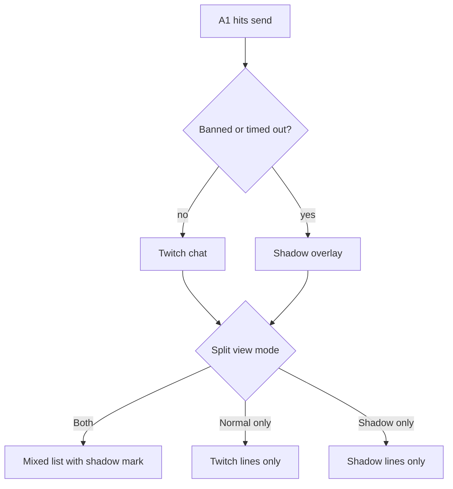
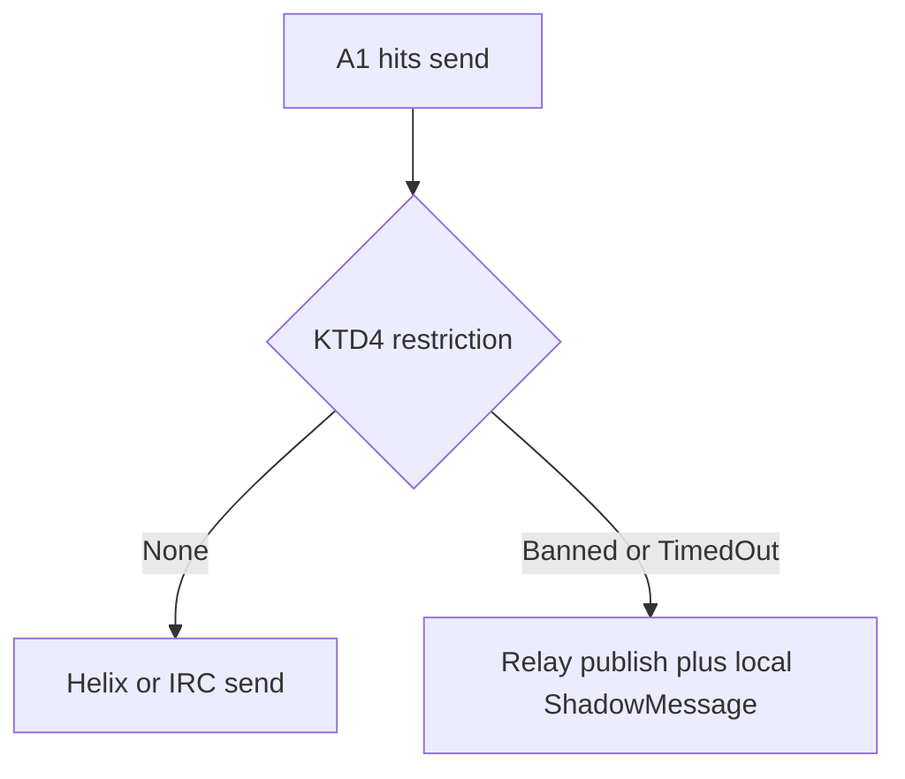
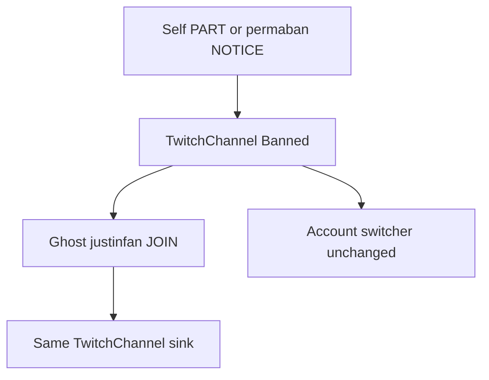
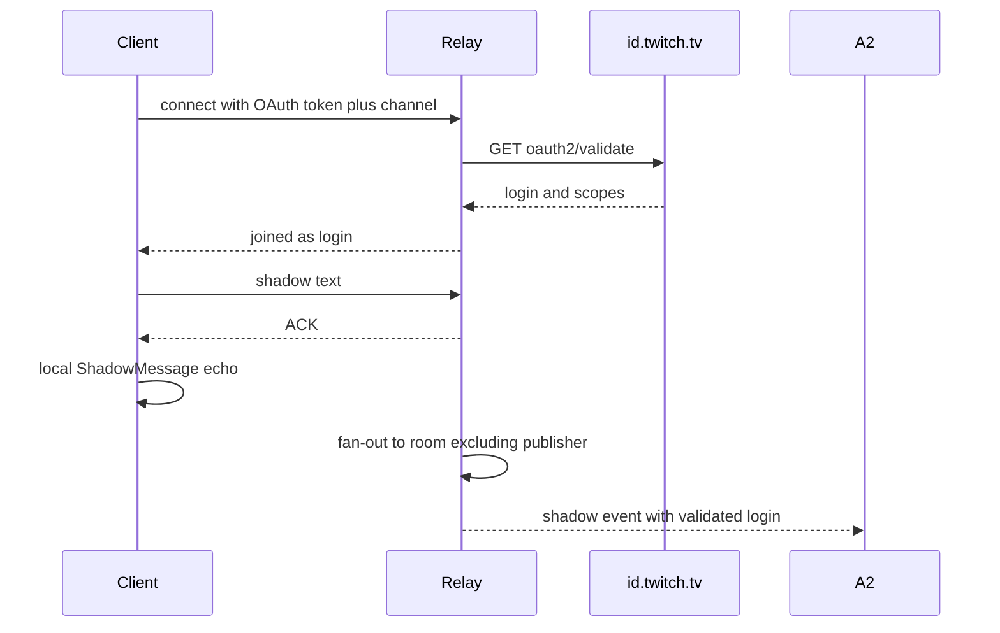

# Shadow Chat - Plan

## Goal Capsule

- **Objective:** Anyone on this Chatterino fork can stay on their usual Twitch account, keep seeing a channel after a ban, send into a public in-channel shadow overlay while banned or timed out, and switch that overlay with a header control.
- **Product authority:** This Product Contract is the authority for user-facing behavior. The Planning Contract is the authority for how it is built. Surrounding ideas (presence, private rooms, Discord-style history) are not active scope.
- **Open blockers:** None.
- **Execution profile:** Code. Prove restriction and send routing with gtest first. Prove header and ghost-reader behavior with a two-client manual pass against AE1–AE5.
- **Stop conditions:** Do not add a settings UI for the relay, reply threads in shadow, presence, or history. Do not switch the visible account to anonymous to keep chat after a ban.
- **Tail ownership:** The implementer owns the gitignored relay and the compiled-in URL. Changing the hosted address requires a client rebuild.
- **Product Contract preservation:** restructured, no scope change: Outstanding Questions (transport, post-ban watch, header placement, view-mode persistence) → KTD1–KTD5.

---

## Product Contract

### Summary

A marked in-channel overlay for this Chatterino fork: the user stays on their usual Twitch account, keeps seeing the channel after a ban, and when banned or timed out their send goes to shadow chat for other people on this fork in that channel. Default view is both streams in one mixed list, with a header switch for Both / Normal only / Shadow only, and a clear status when sends are not going to Twitch.

### Problem Frame

Today a banned person loses the channel in Chatterino and switches accounts or leaves for Discord. Timed-out people can still watch, but a send that Twitch will not take has no in-client place to go. Official clients never show those lines. The cost is account-switching and a second app for a conversation that belongs next to the live channel.

### Key Decisions

- **Public overlay, not a known group.** Anyone using this fork in that channel receives shadow messages; each split's view mode still applies. (session-settled: user-directed — chosen over a Discord-like known group, local-only, or public-watch/private-send: the overlay is for anyone who installs.) Governs R5, R6.
- **Shadow send only when banned or timed out.** Not on every failed send, and not a mirror of every Twitch send. (session-settled: user-directed — chosen over permanent-ban-only, any Twitch refusal, or always-mirror.) Governs R7, R8.
- **Header switch and one mixed list.** Compact control on the channel; Both is one timeline with shadow lines marked. (session-settled: user-directed — chosen over a big bar above the input or two panes.) Governs R9, R10, R11.
- **Marked overlay, not quiet and not presence.** When the user cannot send to Twitch, the client says so. No fork-user presence layer. (session-settled: user-approved — chosen over quiet overlay or presence overlay: avoid thinking a line hit Twitch, without building a second social network.) Governs R12.
- **Stay on the usual account.** Success is using the same username they always used, not anonymous and not an alt. Governs R1, R2.
- **Live overlay only.** No Discord-style history in this cut. Confirmed with the scoping synthesis. Governs R13.

### Actors

- A1. Fork user watching a channel on this Chatterino, on their usual Twitch account, possibly banned or timed out.
- A2. Other people using this fork in the same channel. They need not be banned.
- A3. Twitch and official clients. They never receive shadow messages.

### Requirements

**Identity and watching**

- R1. The user remains signed in as their usual Twitch account while watching and while sending to shadow chat.
- R2. After a channel ban, this client keeps showing that channel's live Twitch chat to A1. They do not have to switch accounts or go anonymous in the UI.
- R3. During a timeout, live Twitch chat continues as it does today.
- R4. Shadow messages show the sender's usual Twitch username.

**Shadow send**

- R5. A shadow message is delivered to every A2 on this fork in that channel. Visibility still respects each split's view mode (hidden in Normal only per R11).
- R6. A3 never sees shadow messages.
- R7. When A1 hits send while banned or timed out, the message goes to shadow chat and is not treated as a successful Twitch send.
- R8. Shadow send is only for ban or timeout. After a timeout ends, the next send goes to Twitch.

**View modes**

- R9. Each channel split has a header control with three modes: Both, Normal only, Shadow only.
- R10. Default mode is Both: one mixed chronological list. Shadow lines carry a visible mark so they are distinguishable from Twitch lines.
- R11. Normal only hides shadow messages. Shadow only hides Twitch chat lines. Switching mode does not change who the user is signed in as.

**Status**

- R12. While A1 is banned or timed out, the client shows a clear status that sends go to shadow chat, not to Twitch.
- R13. Shadow messages are live in the open channel view. This cut does not persist Discord-style history.

### Key Flows

- F1. Watch after a ban
  - **Trigger:** A1 is banned from the channel they have open.
  - **Actors:** A1, A3
  - **Steps:** Twitch drops or refuses the usual chat session. This client keeps showing live channel chat. A1 stays shown as their usual account. Status per R12 is visible.
  - **Outcome:** A1 does not switch accounts to keep watching.
  - **Covered by:** R1, R2, R12

- F2. Send while restricted
  - **Trigger:** A1 hits send while banned or timed out.
  - **Actors:** A1, A2, A3
  - **Steps:** The client does not treat the send as a Twitch success. The line appears in shadow overlay as A1's usual username. A2 in Both or Shadow only see it. A3 do not.
  - **Outcome:** The conversation stays in the channel view for this fork.
  - **Covered by:** R1, R4, R5, R6, R7, R12

- F3. Switch view mode
  - **Trigger:** A1 picks Both, Normal only, or Shadow only on the split header.
  - **Actors:** A1
  - **Steps:** The same split list filters immediately. Rebuild the ChannelView filtered snapshot (re-setChannel or refreshFilteredMessages) so already-copied lines are re-evaluated. Both shows mixed marked lines. Normal only and Shadow only hide the other stream.
  - **Outcome:** Mode is easy to change without leaving the channel or changing account.
  - **Covered by:** R9, R10, R11

- F4. Timeout ends
  - **Trigger:** A1's timeout expires and they hit send.
  - **Actors:** A1, A3
  - **Steps:** The send goes to Twitch, not shadow chat. Restriction status from R12 clears.
  - **Outcome:** Shadow is automatic while restricted, not a sticky send target.
  - **Covered by:** R8, R12

### Acceptance Examples

- AE1. Ban, keep watching
  - **Covers R1, R2.**
  - **Given:** A1 is in `#channel` on their usual account.
  - **When:** they are banned from that channel.
  - **Then:** live Twitch chat in that split continues and the UI still shows their usual account.

- AE2. Ban, send to overlay
  - **Covers R4, R5, R6, R7, R12.**
  - **Given:** A1 is banned and A2 is in the same channel on this fork. Someone on official Chatterino is also in the channel.
  - **When:** A1 sends `still here`.
  - **Then:** A1 and A2 see `still here` as a marked shadow line from A1's usual username. The official client does not. Status says sends go to shadow chat.

- AE3. Timeout, then Twitch again
  - **Covers R3, R7, R8.**
  - **Given:** A1 is timed out.
  - **When:** they send during the timeout, then send again after it ends.
  - **Then:** the first line is shadow-only. The second line is a normal Twitch message. Live Twitch chat was visible the whole time.

- AE4. Followers-only is not shadow
  - **Covers R8.**
  - **Given:** A1 is not banned or timed out, but Twitch refuses the send for followers-only or a similar non-ban rule.
  - **When:** they hit send.
  - **Then:** the client does not place that line in shadow chat.

- AE5. View modes
  - **Covers R9, R10, R11.**
  - **Given:** the split is in Both and shows mixed Twitch and marked shadow lines.
  - **When:** A1 picks Normal only, then Shadow only, then Both.
  - **Then:** Normal only shows Twitch lines only. Shadow only shows shadow lines only. Both restores the mixed marked list. A1 is still on their usual account.

### Success Criteria

- A banned or timed-out user can stay on the account they always used and not need a second account or Discord for watching plus talking to other people on this fork in that channel.
- A first-time fork user in a channel sees Both by default and can tell shadow lines from Twitch lines.

### Scope Boundaries

**Deferred for later**

- Fork-user presence (who else on this fork is in the channel).
- Private or invite-only shadow rooms.
- Discord-style persistence / history of shadow messages.

**Outside this product's identity**

- Replacing Twitch moderation or showing shadow lines on official clients.
- A second social network inside Chatterino.

### Dependencies / Assumptions

- A2 must also run this fork to see shadow messages. Twitch will not carry them.
- Overlay transport is KTD2 and KTD3. Product behavior stays R5 and R6.
- Watch-after-ban while staying on the usual account is KTD1. Product behavior stays R1 and R2.
- View mode is per channel split, matching the header control in R9.
- The smallest useful cut was left unspecified by the user. This contract keeps both watching-after-ban and restricted-send, as confirmed.

### Outstanding Questions

**Resolve Before Planning**

- None.

**Deferred to Implementation**

- Exact JSON field names on the relay envelope.
- Whether one ghost IRC connection can JOIN many banned channels or one connection per channel.
- Emote rendering quality on shadow lines versus Twitch-parsed lines.

### Sources / Research

- No shadow-chat feature exists on this branch. Adjacent pieces: anonymous `justinfan` viewing in `src/providers/twitch/TwitchCommon.hpp`; ban/PART notices in `src/providers/twitch/IrcMessageHandler.cpp`; Forbidden send path in `src/providers/twitch/TwitchIrcServer.cpp`; secondary streams (mentions, whispers, watching) in `src/providers/twitch/TwitchIrcServer.cpp`; per-split filters in `src/widgets/helper/ChannelView.cpp`; token check in `src/providers/twitch/TwitchAccountManager.cpp` (`id.twitch.tv/oauth2/validate`); `SplitDescriptor` in `src/common/WindowDescriptors.hpp`.

---

## Planning Contract

### Key Technical Decisions

- KTD1. **Hidden ghost IRC reader after ban.** When the authenticated session is PARTed, a second read-only `justinfan` IRC connection JOINs that channel and feeds the same `TwitchChannel` sink. `TwitchAccountManager` current user does not change. (session-settled: user-approved — chosen over switching the visible account to anonymous: keep R1/R2.) Instantiates R1, R2.
- KTD2. **Gitignored npm WebSocket relay, compiled-in URL.** Room per Twitch channel. Live broadcast only. Path `shadow-relay/` is gitignored. Client URL is a compile-time constant, not a setting, not shown in UI. (session-settled: user-directed — chosen over P2P or a user-visible/changeable URL.) Instantiates R5, R6, R13.
- KTD3. **Relay names come from Twitch `oauth2/validate`.** Client presents the logged-in OAuth token over the relay socket. Relay calls `https://id.twitch.tv/oauth2/validate` (same check as `TwitchAccountManager`) and uses returned `login` only when the token is valid and includes chat scopes. (session-settled: user-directed — chosen over trusting a client-claimed name.) Instantiates R4.
- KTD4. **Explicit restriction state on `TwitchChannel`.** `None | TimedOut | Banned`. Ban from self-PART plus permaban NOTICE. Timeout from self CLEARCHAT with duration, distinct from slow-mode `sendWait`. Clear timeout when the timer ends. Clear ban on successful re-JOIN for that channel. Instantiates R7, R8, R12.
- KTD5. **New `MessageFlag::ShadowMessage` (bit 46) and persist view mode on the split.** Do not reuse `SharedMessage`. Both/Normal/Shadow is split-local, saved on `SplitDescriptor` like `moderationMode_`. Default Both. Instantiates R9, R10, R11.

### High-Level Technical Design

Restriction and send:

Watch after ban:

Relay:

### Assumptions

- The operator will run `shadow-relay` locally during development and host it later. The compiled URL is updated in a rebuild.
- Sending the OAuth token to this fork's relay is accepted because the URL is operator-controlled and hidden from users.
- Self-PART after a ban is the reliable watch-stop signal on the authenticated read connection.
- Followers-only and similar Helix `Forbidden` cases occur while restriction is `None`, so they stay off the shadow path per R8.

### Implementation Constraints

- Do not call `TwitchAccountManager` anonymous fallback to satisfy R2.
- Do not add GeneralPage or Settings entries for the relay URL.
- Intercept send in `TwitchChannel::sendMessage` / reply path before `TwitchIrcServer::sendHelixMessage`.
- Ghost reader must not appear in the account switcher.
- `shadow-relay/` must remain untracked.

### Sequencing

1. U1 restriction state.
2. U2 flag and view filter.
3. U3 relay plus client connection.
4. U4 send intercept.
5. U5 ghost reader.
6. U6 header, status, persistence.

U1–U3 can overlap. U4 needs U1–U3. U5 needs U1. U6 needs U1 and U2.

### Alternative Approaches Considered

- **P2P mesh.** Rejected: NAT, scale in busy channels, still needs identity. User chose a hosted npm relay.
- **7TV / BTTV / EventSub as transport.** Rejected: they cannot carry arbitrary user text.
- **Global anonymous account for watch-after-ban.** Rejected: violates R1.
- **Trust client-asserted username.** Rejected: user required `oauth2/validate`.

---

## Implementation Units

### U1. Restriction state on TwitchChannel

- **Goal:** Know whether the current user is banned, timed out, or unrestricted on a channel, without using generic Helix Forbidden or slow-mode wait as the shadow gate.
- **Requirements:** R7, R8, R12. F1, F2, F4. AE3, AE4. KTD4.
- **Dependencies:** None.
- **Files:** `src/providers/twitch/TwitchChannel.hpp`, `src/providers/twitch/TwitchChannel.cpp`, `src/providers/twitch/IrcMessageHandler.cpp`, `tests/src/TwitchChannel.cpp`, `tests/src/IrcMessageHandler.cpp`
- **Approach:**
  1. Add restriction state and a GUI-thread signal when it changes.
  2. Set Banned from permaban NOTICE and self-PART for that channel.
  3. Set TimedOut from self CLEARCHAT with duration. Keep slow-mode `sendWait` separate.
  4. Clear TimedOut when the timeout ends. Clear Banned when the authenticated session successfully re-JOINs.
- **Patterns to follow:** `TwitchChannel::setSendWait` / `sendWaitUpdate`; `IrcMessageHandler` CLEARCHAT and NOTICE handling; `MessageSink` tests in `tests/src/IrcMessageHandler.cpp`.
- **Test scenarios:**
  - Covers AE4. Restriction stays None when Helix would refuse followers-only. Shadow routing must not activate.
  - Covers AE3. Self CLEARCHAT with duration sets TimedOut; after the wait, state is None.
  - Permaban NOTICE sets Banned.
  - Self-PART sets Banned.
  - Slow-mode `sendWait` does not set TimedOut.
- **Verification:** Focused gtest on IrcMessageHandler and TwitchChannel. Restriction signal fires only on the cases above.

### U2. Shadow flag and ChannelView filter

- **Goal:** Mark shadow lines and filter them per split view mode.
- **Requirements:** R9, R10, R11. F3. AE5. KTD5.
- **Dependencies:** None.
- **Files:** `src/messages/MessageFlag.hpp`, `src/messages/MessageBuilder.cpp`, `src/messages/layouts/MessageLayout.cpp`, `src/widgets/helper/ChannelView.hpp`, `src/widgets/helper/ChannelView.cpp`, `src/widgets/splits/Split.hpp`, `src/widgets/splits/Split.cpp`, `src/common/WindowDescriptors.hpp`, `src/common/WindowDescriptors.cpp`, `src/widgets/splits/SplitContainer.cpp`, `src/messages/search/MessageFlagsPredicate.cpp`, `docs/lua-meta/globals.lua`, `tests/src/Filters.cpp`, `tests/src/FlagsEnum.cpp`, `src/CMakeLists.txt` if new sources appear
- **Approach:**
  1. Add `ShadowMessage = (1LL << 46)` and Lua/search wiring.
  2. Build a visible mark using the Shared Chat badge pattern, without setting `SharedMessage`.
  3. Add `ShadowViewMode { Both, Normal, Shadow }` on `Split` / `SplitDescriptor`, default Both. U6 adds header UI and JSON round-trip; U2 stores the field so `ChannelView::shouldIncludeMessage` can read per-split mode.
  4. Extend `ChannelView::shouldIncludeMessage`: Normal skips `ShadowMessage`; Shadow keeps `ShadowMessage` chat lines; Both keeps both. Apply after existing `FilterSet`.
- **Patterns to follow:** `MessageFlag::SharedMessage` plus badge in `MessageBuilder`; `ChannelView::shouldIncludeMessage`; `ChannelView::mayContainMessage` for mentions/whispers.
- **Test scenarios:**
  - Covers AE5. Both includes Twitch and shadow flags. Normal excludes shadow. Shadow excludes non-shadow chat lines.
  - System/status lines still appear in Both and Normal.
  - Search/filter identifier for the new flag does not crash.
- **Verification:** FlagsEnum and filter tests pass. A constructed shadow message is distinguishable in layout tests if a layout case already exists; otherwise flag + filter is enough for this unit.

### U3. Gitignored npm relay and hardcoded client

- **Goal:** Live fan-out among fork clients in a channel, with Twitch-validated names, no user-facing URL.
- **Requirements:** R4, R5, R6, R13. F2. AE2. KTD2, KTD3.
- **Dependencies:** None.
- **Files:** `shadow-relay/` (new, gitignored), `.gitignore`, `src/common/Env.hpp`, `src/common/Env.cpp`, `src/providers/shadow/` (new client), `src/Application.cpp` or equivalent provider init, `src/CMakeLists.txt`, `tests/src/WebSocketPool.cpp` or `tests/src/ShadowRelay.cpp`, `tests/CMakeLists.txt`
- **Approach:**
  1. Add `/shadow-relay/` to `.gitignore`. Implement a small Node WebSocket server: join room by channel, no history, broadcast JSON events.
  2. On connect, require the OAuth token. Validate via `id.twitch.tv/oauth2/validate`. Reject if invalid or chat scopes missing. Bind the socket to returned `login`.
  3. Compile the relay URL into `Env` (or a dedicated constant). Never expose it in Settings or GeneralPage.
  4. Subscribe and unsubscribe shadow relay rooms per `TwitchChannel` (or `roomId`), mirroring 7TV/BTTV channel lifecycle in `TwitchChannel`. One connection per channel regardless of how many splits display it. Wait for `roomId` like 7TV before subscribing.
  5. If validate errors or times out, reject the connection (fail closed). Do not fall back to a client-claimed name.
- **Patterns to follow:** `src/common/websockets/WebSocketPool.hpp`; `src/providers/liveupdates/BasicPubSubManager.hpp`; `TwitchAccountManager` validate request; `tests/src/BasicPubSub.cpp`.
- **Execution note:** Keep the relay source on disk for the operator. Do not commit it.
- **Test scenarios:**
  - Covers AE2. Two client fixtures in the same room: a validated publish is received by the other with the validate `login`, not a spoofed name.
  - Invalid token is rejected and no fan-out occurs.
  - Token missing `chat:edit` / `chat:read` is rejected.
  - Relay holds no transcript after disconnect (live-only).
- **Verification:** Node relay starts locally. Client unit tests mock validate + socket. Manual two-process smoke is required before U4 is done.

### U4. Send intercept to shadow

- **Goal:** Banned or timed-out sends go to the relay and local echo, not Twitch.
- **Requirements:** R4, R5, R6, R7, R8. F2, F4. AE2, AE3, AE4. KTD3, KTD4.
- **Dependencies:** U1, U2, U3.
- **Files:** `src/providers/twitch/TwitchChannel.cpp`, `src/providers/twitch/TwitchIrcServer.cpp`, `src/widgets/splits/SplitInput.cpp`, `tests/src/SplitInput.cpp`, `tests/src/TwitchChannel.cpp`
- **Approach:**
  1. Before `sendMessageSignal` / Helix, if restriction is Banned or TimedOut, publish to the relay. Echo a local `ShadowMessage` only after relay ACK. Skip Twitch.
  2. Dedup: relay excludes the publisher from fan-out. Client also suppresses incoming events that match a pending local send id, so the sender never sees a duplicate line.
  3. Apply the same gate to reply-send: v1 publishes plain text only (no thread).
  4. If restriction is None, existing Twitch path is unchanged, including followers-only Forbidden.
- **Patterns to follow:** `TwitchChannel::sendMessage`; `TwitchIrcServer::onMessageSendRequested`; `SplitInput::handleSendMessage` / `postMessageSend`.
- **Test scenarios:**
  - Covers AE2. Banned send does not call Helix. Local message has `ShadowMessage` and usual login.
  - Covers AE3. TimedOut send goes to shadow. After TimedOut clears, next send takes the Twitch path.
  - Covers AE4. None + later Forbidden does not publish to the relay.
  - Input clears after a successful shadow send the same as a Twitch send.
- **Verification:** TwitchChannel/SplitInput tests. Helix mock is not invoked when restricted.

### U5. Ghost reader for banned watch

- **Goal:** Live Twitch chat continues after ban without changing the visible account.
- **Requirements:** R1, R2. F1. AE1. KTD1.
- **Dependencies:** U1.
- **Files:** `src/providers/twitch/TwitchIrcServer.hpp`, `src/providers/twitch/TwitchIrcServer.cpp`, `src/providers/twitch/IrcMessageHandler.cpp`, `src/providers/twitch/TwitchAccountManager.cpp` (read-only use of anonymous credentials, not current-user swap), `tests/src/TwitchIrc.cpp` or `tests/src/IrcMessageHandler.cpp`
- **Approach:**
  1. On Banned, start a ghost read connection using anonymous username credentials. Prefer one ghost connection that JOINs each restricted channel (not one socket per split).
  2. Route ghost PRIVMSG into the existing `TwitchChannel` as original Twitch lines (no `ShadowMessage`).
  3. Do not change `getCurrent()`, account switcher, or `ANONYMOUS_USERNAME_LABEL` in the UI.
  4. Stop the ghost JOIN when restriction leaves Banned. If ghost JOIN fails, show reconnectable status and keep the usual account visible.
- **Patterns to follow:** Dual `readConnection_` / `writeConnection_` in `TwitchIrcServer`; anonymous connect without OAuth password; `assertInGuiThread` for channel mutations.
- **Execution note:** Add characterization coverage around self-PART before changing join behavior.
- **Test scenarios:**
  - Covers AE1. After self-PART, ghost path is armed and current username is unchanged.
  - Ghost PRIVMSG is added to the channel without `ShadowMessage`.
  - Leaving Banned stops ghost JOIN.
  - Opening anonymous mode globally is unchanged for users who are not using shadow-watch.
- **Verification:** Handler tests plus a manual ban in a test channel: chat keeps scrolling, account chip still shows the usual name.

### U6. Header control, status, and persistence

- **Goal:** Easy Both / Normal / Shadow switch, restriction status, and saved mode.
- **Requirements:** R9, R10, R11, R12. F3. AE5. KTD5.
- **Dependencies:** U2, U1.
- **Files:** `src/widgets/splits/SplitHeader.hpp`, `src/widgets/splits/SplitHeader.cpp`, `src/widgets/splits/Split.hpp`, `src/widgets/splits/Split.cpp`, `src/widgets/splits/SplitInput.hpp`, `src/widgets/splits/SplitInput.cpp`, `src/common/WindowDescriptors.hpp`, `src/common/WindowDescriptors.cpp`, `src/singletons/WindowManager.cpp` if layout load needs a default
- **Approach:**
  1. Add a compact tri-state control in `SplitHeader` near existing mode buttons (`LabelButton` or equivalent), with a selected-state affordance.
  2. Wire it to `ChannelView` include rules from U2. Default Both. On mode change, rebuild the filtered channel snapshot (re-setChannel or `refreshFilteredMessages`) so already-copied lines are re-filtered.
  3. Persist on `SplitDescriptor` JSON (round-trip Both / Normal / Shadow; missing field loads as Both).
  4. When restriction is Banned or TimedOut, show status on `SplitInput` distinct from `sendWaitStatus`: sends go to shadow chat, not Twitch. Relay disconnect while restricted uses a distinct persistent status, not the same string as a failed shadow send.
- **Patterns to follow:** `moderationMode_` persist; `Split::setSendWaitStatus`; `SplitHeader::initializeLayout`.
- **Test scenarios:**
  - Covers AE5. Descriptor round-trip stores Both / Normal / Shadow. Missing field loads as Both.
  - Restriction signal updates input status; clearing restriction hides it.
- **Verification:** WindowDescriptors serialize/deserialize. Manual: header control filters the list; status appears only while restricted.

---

## System-Wide Impact

- **Auth:** The hidden relay receives the user's Twitch OAuth token for validate. Token must not be logged. TLS for hosted `wss`.
- **Layout JSON:** Saved window layouts gain a view-mode field. Older layouts default to Both.
- **Plugins:** New `MessageFlag` bit must be generated into Lua meta so plugins do not see an unknown gap.
- **IRC:** A second connection increases join-bucket use while banned.

---

## Risks & Dependencies

- **Token to relay.** Mitigate: wss, no token in logs, validate then drop raw token from room broadcasts.
- **Self-PART is not only bans.** Unexpected drops may arm Banned and the ghost reader. Prefer pairing PART with permaban NOTICE when both arrive; if only PART arrives, still keep chat (R2) and show status.
- **Twitch ToS / ban evasion.** This fork's overlay is out of band. Do not document it in upstream Chatterino channels.
- **Relay downtime.** Shadow send fails closed: show an error, do not fall back to Twitch while restricted.
- **MessageFlag bit space.** Bit 46 is the next slot; update `magic_enum` range if required in `MessageFlag.hpp`.
- **Ghost JOIN after self-PART.** If the anonymous read connection fails to JOIN, watch-after-ban (R2/AE1) breaks. Surface a reconnectable status; do not swap the visible account.
- **JOIN bucket.** A second IRC connection while banned uses extra JOIN capacity. Prefer one ghost connection with multi-JOIN over one connection per channel when several splits are banned.

---

## Documentation / Operational Notes

- Local: run the gitignored npm relay, point the compiled URL at it, rebuild the client.
- Hosting later: change the compiled URL, rebuild, distribute that build. Users have no UI to retarget.
- Do not add user-facing docs that publish the relay address.

---

## Verification Contract

- Configure and build with the repo CMake flow (`cmake -B build` then `cmake --build build`).
- `cd build && ctest --output-on-failure`
- Focused: `./build/bin/chatterino-test --gtest_filter='TestIrcMessageHandlerP*:SplitInputTest:*TwitchChannel*:*Shadow*:*FlagsEnum*'`
- Manual gate before done: two fork clients on one channel covering AE1–AE5 (ban watch, shadow send/receive, timeout then Twitch, followers-only not shadow, view modes).

---

## Definition of Done

- R1–R13 and AE1–AE5 hold on a two-client pass.
- U1–U6 test scenarios that can run in gtest are green.
- No relay URL or token appears in Settings, logs, or committed files.
- `shadow-relay/` is gitignored and untracked.
- Abandoned spikes (extra connections, debug overlays) are removed from the diff.

---

## Appendix

External research that shaped KTD2/KTD3: 7TV EventAPI and BTTV WebSocket cannot carry arbitrary user messages. Twitch EventSub `channel.chat.message` is a read path, not shadow transport. Hosted ephemeral WebSocket rooms are the matching prior art. Public overlays that show Twitch names need server-side identity; this plan uses Chatterino's existing `oauth2/validate` check.
