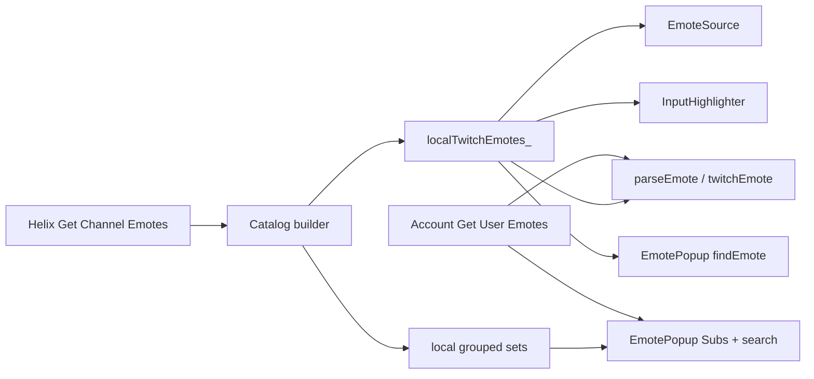
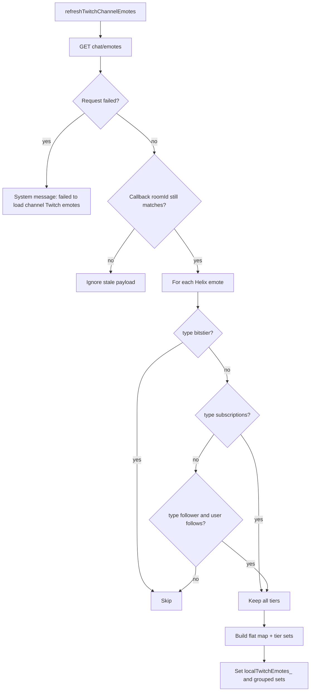
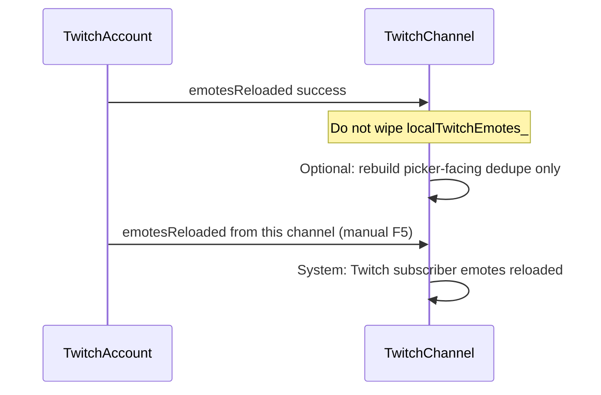

# feat: Show every channel sub-tier emote

## Goal Capsule

- **Objective:** In every Twitch channel, this client treats that channel’s subscriber emotes at every tier (T1, T2, T3) as usable and visible — in chat, completion, and the emote picker — even when the signed-in account has not unlocked that tier.
- **Product authority:** This Product Contract is the authority for user-facing behavior. The Planning Contract is the authority for how it is built.
- **Open blockers:** None.
- **Execution profile:** Code. Prove catalog grouping and name lookup with gtest. Prove picker grouping with a short manual pass in a channel that has multiple sub tiers.
- **Stop conditions:** Do not add a settings toggle. Do not load other channels’ locked sub emotes into this channel. Do not include bits-tier emotes. Do not change follower-emote follow gating. Do not add a new shadow-specific emote path.
- **Tail ownership:** The implementer owns Helix `tier` parsing, the per-channel catalog, picker grouping, and tests. Twitch’s own IRC tagging of unowned emotes is unchanged and out of this client’s control.

---

## Product Contract

### Summary

In the channel you are watching, every subscriber emote that channel publishes (Tier 1, 2, and 3) is available to type, tab-complete, pick from the emote dialog, and render as an image locally — including on shadow-chat lines that have no IRC emote tags. Official Twitch clients still only show an image when Twitch tags the emote. Follower emotes stay follow-gated. Bits emotes stay out of this work.

### Problem Frame

Helix Get Channel Emotes already returns the full channel catalog, including every subscription tier. This client currently keeps only `follower` emotes in `localTwitchEmotes_`, and only after a follow check. If the account already has the synthetic set `x-c2-s-{roomId}` (any sub or follower emote from that channel, including T1), the local map is emptied and never filled. The emote picker then either omits T2/T3 or dumps whatever locals remain under `{channel} (Follower)`. Incoming IRC from people who own the emote still renders via tags; untagged text, your own send, completion, and shadow lines do not.

### Actors

- A1. Fork user watching a Twitch channel, at any sub/follow state (none, T1, T2, T3, broadcaster).
- A2. Other people using this fork in the same channel. They see name-parsed images for this channel’s catalog.
- A3. Twitch and official clients. They keep current tagging rules: unowned names stay text.

### Requirements

- R1. While A1 is in a channel, every `subscriptions` emote that channel publishes (Helix tiers `1000`, `2000`, `3000`) is usable there: insert from the picker, tab-complete, and type the code.
- R2. Those emotes render as images in that channel’s chat when the name appears in untagged text (own send, other people’s untagged lines, shadow lines), the same way BTTV/7TV/FFZ names already do.
- R3. Incoming IRC that already carries `emotes` tags keeps rendering via those tags and `getOrCreateEmote`. This work must not break that path.
- R4. The emote dialog Subs tab (and its search) shows this channel’s T1, T2, and T3 emotes as images under distinct tier headings, not under a single Follower label and not as missing/broken entries.
- R5. Catalog membership is per viewed channel. Unowned T2/T3 of `#a` must not complete, pick, or name-render in `#b`.
- R6. Follower emotes stay follow-gated. A failed or negative follow check omits follower emotes only; it must not omit subscription emotes.
- R7. Owned emotes of *other* channels stay available globally as they do today (account Get User Emotes).
- R8. Clicking a catalog emote in the picker inserts its name. Favourites that resolve through `findEmote` still resolve for these names.
- R9. No new setting. The behavior is always on for this fork.

### Key Flows

- F1. Join or switch to a channel → load that channel’s Helix catalog → T1/T2/T3 available in input, completion, picker, and local parse.
- F2. Open the emote dialog in that channel → Subs tab lists this channel’s tiers with images, then other owned sub sets.
- F3. Send or shadow-send a T2/T3 name you do not own → this client shows an image; A3 sees text unless Twitch tagged it.
- F4. Reload subscriber emotes / account emotes finish loading → T2/T3 of this channel remain; they are not wiped because the account has T1.

### Acceptance Examples

- AE1. A1 is not subscribed and not following `#streamer`. Typing a T2 code of `#streamer` renders an image in that split. Follower emotes of `#streamer` are absent. Covers R1, R2, R6.
- AE2. A1 is a T1 sub of `#streamer`. The picker Subs tab shows T1, T2, and T3 of `#streamer` as images under separate headings. T2/T3 complete. Covers R1, R4.
- AE3. A1 sends a T3 code of `#streamer` they do not own. This client’s local line (and a shadow line with empty tags) contains an `EmoteElement`. Covers R2, F3.
- AE4. A1 switches to `#other`. The T2 code of `#streamer` that they do not own no longer completes or name-renders. Covers R5.
- AE5. A1 follows `#streamer` but is not subscribed. Follower emotes appear under a Follower heading; sub tiers still appear. Covers R4, R6.
- AE6. Someone else sends a tagged T3 emote. Rendering still uses IRC tags (R3).

### Success Criteria

- In a multi-tier channel, a T1 (or non-sub) user can pick, complete, and locally render T2 and T3 of *that* channel.
- The Subs tab headings match the actual emote types (Tier 1 / Tier 2 / Tier 3 / Follower), and the icons load from the Twitch CDN IDs.
- Existing tagged IRC emote snapshots and BTTV shadow-line emote tests still pass.

### Scope Boundaries

**In scope**

- Helix `tier` on channel/user emote objects.
- Per-channel local Twitch catalog of `subscriptions` (all tiers) plus follow-gated `follower`.
- Emote picker Subs tab and search grouping for this channel.
- Completion and input highlight picking up the same catalog.
- Tests for grouping, filter rules, name lookup, and shadow-line render.

**Out of scope**

- Bits / `bitstier` emotes in the channel catalog or picker.
- Making Twitch IRC tag or accept unowned emotes for A3.
- A settings toggle, warning banner, or emote-only-mode special UI.
- Loading locked sub emotes of channels you are not currently viewing.
- Shared-chat source-channel catalogs (viewed channel only).
- Changing `parseEmote` third-party vs Twitch precedence (7TV/BTTV/FFZ still win on untagged text).
- Live Helix refresh when a streamer adds emotes (manual reload / rejoin stays as today).

### Deferred to Follow-Up Work

- Per-tier headings on *other* channels’ owned sets in the Subs tab (account Get User Emotes grouping can stay one set per owner).
- Paginated Get Channel Emotes if Twitch ever truncates large catalogs (today the call is a single request).

---

## Planning Contract

### Assumptions

Scoping confirmation was skipped for this run. These inferred bets are recorded here:

- “Use” means this client’s picker, completion, highlighter, and name-based parse — not Twitch accepting unowned emotes on IRC.
- Unowned T1 is included for non-subs, not only tiers above the user’s current sub.
- The local map stores the full channel catalog (all sub tiers, plus follower if followed). Owned names are still in the account map; consumers dedupe rather than emptying the catalog.
- Anonymous / logged-out users keep today’s Helix-token behavior (no catalog if the call cannot run).
- No extra UI when Helix/IRC rejects an unowned emote-only send; existing error and shadow fallback stay.

### Key Technical Decisions

- KTD1. **Channel catalog is the source of truth for this channel’s Twitch sub/follower emotes.** Extend the existing `localTwitchEmotes_` follower-catalog pattern rather than asking Get User Emotes for locked tiers. Get User Emotes is access-filtered and cannot supply T2/T3 the user does not own. Governs R1, R2, R5.
- KTD2. **Always call Get Channel Emotes. Follow-gate only `follower`.** Remove the `hasEmoteSet(x-c2-s-{roomId})` early return and the matching wipe on `emotesReloaded`. That synthetic ID is shared by T1 and follower, so the skip/wipe is exactly why T1 users never see T2/T3. Governs R1, R4, R6, F4.
- KTD3. **Parse Helix `tier` and group the *channel* catalog by type+tier.** Keep account Get User Emotes set IDs as they are (one `x-c2-s-{owner}` set). The picker shows this channel from the catalog (Tier 1 / Tier 2 / Tier 3 / Follower) and skips the account set whose owner is the current `roomId` so T1 is not listed twice. Other channels’ owned sets stay on the account path (R7). Governs R4.
- KTD4. **One flattened `localTwitchEmotes_` plus a grouped set map for the picker.** Lookup, completion, highlighter, `findEmote`, and shadow `parseEmote` already read the flat map. Do not add a shadow-specific emote path. Governs R2, R8, F3.
- KTD5. **Extract a pure catalog builder** (Helix list + includeFollower → flat map + grouped sets) so tests do not need to fight `getApp()->isTest()` skipping `refreshTwitchChannelEmotes`. Add `setLocalTwitchEmotes` mirroring `setBttvEmotes` for parse/shadow/completion tests.

### High-Level Technical Design

Channel catalog sits beside account emotes. Consumers already know how to read the local map; the load rules and picker grouping change.

Load filter (directional guidance, not implementation specification):

Account reload must not clear that catalog:

### Sequencing

U1 (Helix tier + grouping helper) first. U2 (load path) depends on U1. U3 (picker + completion dedupe) depends on U2’s grouped sets and flat map. U4 tests land with the units they prove; the shadow/completion injection tests need U2’s setter.

### Implementation Constraints

- `EmoteMap` is keyed by name. If two IDs share a code, keep the first (`try_emplace` / existing account `reloadEmotes` rule).
- `getApp()->isTest()` must keep skipping live Helix in `refreshTwitchChannelEmotes`; tests go through the extracted builder and setters.
- Re-check `roomId` in the Get Channel Emotes callback before storing.
- Failure copy today is “Failed to load follower emotes.” Change it to channel Twitch emotes, because the fetch is no longer follower-only.
- `IrcMessageHandler.hpp` still names `TwitchMessageBuilder`; do not revive that type. Chat parse lives in `MessageBuilder`.

---

## Implementation Units

### U1. Parse Helix tier and group channel catalog sets

**Goal:** Helix channel/user emote objects expose `tier`, and a testable helper turns a Helix list into flat + grouped channel catalog data with titles per tier.

**Requirements:** R4

**Dependencies:** None

**Files:**
- `src/providers/twitch/api/Helix.hpp` (modify)
- `src/providers/twitch/TwitchEmotes.hpp` (modify)
- `src/providers/twitch/TwitchEmotes.cpp` (modify)
- `tests/src/TwitchEmotes.cpp` (create)
- `tests/CMakeLists.txt` (modify)

**Approach:**
1. Add `tier` (`QString`, same `"1000"` / `"2000"` / `"3000"` / empty pattern as `HelixUserSubscription`) to `HelixChannelEmote`.
2. Extend `TwitchEmoteSet` / `TwitchEmoteSetMeta` enough for channel-catalog titles: `{owner}`, `{owner} (Tier 2)`, `{owner} (Tier 3)`, `{owner} (Follower)`, `{owner} (Bits)` unchanged for bits.
3. Put the catalog builder next to `getTwitchEmoteSetMeta` so U2 only calls it. Do not change account `reloadEmotes` synthetic IDs in this unit (KTD3).
4. Channel subscription sets should distinguish tiers (for example `x-c2-s-{owner}-2000`) so the picker can iterate sets. Follower stays a separate set from T1.

**Patterns to follow:** `getTwitchEmoteSetMeta` and `TwitchEmoteSet::title()` in `src/providers/twitch/TwitchEmotes.cpp`. `HelixUserSubscription.tier` parsing in `src/providers/twitch/api/Helix.hpp`.

**Test scenarios:**
- Helix JSON with `emote_type: subscriptions` and `tier: "2000"` populates `tier` as `2000`.
- `tier` missing or empty stays empty (follower / global).
- Catalog builder keeps `subscriptions` at 1000, 2000, and 3000, keeps `follower` only when includeFollower is true, drops `bitstier`.
- Grouped set titles are `{owner} (Tier 1)`, `{owner} (Tier 2)`, `{owner} (Tier 3)`, `{owner} (Follower)` for those types.
- Two Helix emotes with the same name: flat map keeps the first.

**Verification:** New gtest file is in `test_SOURCES`. Filter `TwitchEmotes*` is green. Account emote-set IDs used by `hasEmoteSet` are unchanged until U2 removes those call sites.

---

### U2. Load every sub tier into the per-channel catalog

**Goal:** Joining or refreshing a channel fills `localTwitchEmotes_` with that channel’s T1–T3 (and follower if followed), and account emote reload no longer wipes it.

**Requirements:** R1, R2, R5, R6, F1, F4

**Dependencies:** U1

**Files:**
- `src/providers/twitch/TwitchChannel.hpp` (modify)
- `src/providers/twitch/TwitchChannel.cpp` (modify)
- `tests/src/TwitchChannel.cpp` (modify)

**Approach:**
1. `refreshTwitchChannelEmotes`: drop the `hasEmoteSet` early return. Always `getChannelEmotes`. Run `getFollowedChannel` only to decide `includeFollower`.
2. In the success callback, ignore stale `roomId`, then store the U1 builder output into `localTwitchEmotes_` and the grouped set map.
3. On `emotesReloaded` success, stop clearing locals when `hasEmoteSet(localTwitchEmoteSetID_)`. Keep the manual-refresh system message.
4. Add `setLocalTwitchEmotes` (and a grouped-set setter or a combined setter) like `setBttvEmotes`. `localTwitchEmoteSetID_` can go if nothing else reads it after the wipe is gone.
5. `TwitchChannel::twitchEmote` stays local map then account map — no new parse path (KTD4).

**Patterns to follow:** Current `refreshTwitchChannelEmotes` Helix callbacks in `src/providers/twitch/TwitchChannel.cpp`. `setBttvEmotes` + `ShadowLineRendersNamedEmote` in `tests/src/TwitchChannel.cpp`.

**Execution note:** Add characterization coverage for name lookup via the new setter before deleting the wipe, so a T1-style `hasEmoteSet` true state cannot regress T2 render.

**Test scenarios:**
- Covers AE1 / AE3. After `setLocalTwitchEmotes` with a T2 name, `twitchEmote` returns it; `addShadowChatLine` with that name and no tags produces an `EmoteElement`.
- Covers AE4. A second channel without that name does not resolve it via its own `twitchEmote` (account fallback still allowed only if the account map has it).
- Catalog builder used by refresh: subscriptions kept without follow; follower omitted when includeFollower is false (covered in U1, asserted again if the channel method wraps the helper).
- Existing `ShadowLineRendersNamedEmote` (BTTV) still passes — third-party order unchanged.

**Verification:** `TwitchChannel*` gtests covering shadow named emotes pass. Manual F5 in a T1-sub channel still shows T2/T3 in completion after account emotes reload.

---

### U3. Emote picker grouping and completion dedupe

**Goal:** The available-emotes dialog shows this channel’s tiers correctly, and completion does not list the same name twice.

**Requirements:** R4, R7, R8, F2

**Dependencies:** U2

**Files:**
- `src/widgets/dialogs/EmotePopup.cpp` (modify)
- `src/controllers/completion/sources/EmoteSource.cpp` (modify)
- `tests/src/InputCompletion.cpp` (modify)

**Approach:**
1. `addTwitchEmoteSets` / `filterTwitchEmotes`: render grouped local sets first (current channel, titles from U1). Stop labeling the whole local map `{channel} (Follower)`.
2. Then account sets, skipping any set whose `owner->id == currentChannelID` when local catalog sets are present, so owned T1 is not duplicated.
3. `findEmote` already prefers `localTwitchEmotes_`; keep that so favourites and click-insert resolve this channel’s ID when names collide with another channel.
4. `EmoteSource::initializeFromChannel`: add local catalog first, then skip account names already present. Provider string can stay `Local Twitch Emotes` or become `Twitch (Channel)` — pick one and use it consistently; do not invent per-tier completion providers.
5. Empty Subs fallback (“no subscription emotes available”) only when both local catalog sets and account sub-like sets are empty.

**Patterns to follow:** Existing `addTwitchEmoteSets` current-channel-first sort in `src/widgets/dialogs/EmotePopup.cpp`. `EmoteSource::initializeFromChannel` local-then-account order.

**Test scenarios:**
- Covers AE2. Completion items include a local T2 name. The same name from the account map is not added a second time.
- Covers AE5. A follower-only local set is titled Follower in the grouping helper (U1); picker uses that title rather than stuffing T2 under Follower.
- Input completion still lists other channels’ owned account emotes whose names are not in the local catalog (R7).
- Widget screenshot tests are not required; grouping titles are proven in U1. Manual: open the emote dialog in a multi-tier channel and confirm images and headings (R4).

**Verification:** `InputCompletion*` tests that inject local Twitch emotes pass. Manual picker check recorded in the unit’s verification, not as a new UI test harness.

---

### U4. Highlighter and parse regression coverage

**Goal:** Input highlight and untagged chat parse see the same catalog as completion, with no change to tagged IRC snapshots.

**Requirements:** R2, R3, AE6

**Dependencies:** U2

**Files:**
- `tests/src/InputHighlighter.cpp` (modify)
- `tests/src/TwitchIrc.cpp` (modify only if a tagged-emote assertion needs a counterpart; prefer existing snapshots)
- `src/widgets/splits/InputHighlighter.cpp` (modify only if it does not already read `localTwitchEmotes_`)

**Approach:**
1. Confirm `InputHighlighter` already consults `localTwitchEmotes_`. If it does, add a test with the new setter; do not change production code.
2. Do not change `parseTwitchEmotes` / `makeIrcMessage` tagged path.
3. If highlighter only checks the account map today, add the local map check in the same order as `twitchEmote` (local then account).

**Patterns to follow:** `tests/src/InputHighlighter.cpp` BTTV injection. `tests/src/TwitchIrc.cpp` tagged emote parsing.

**Test scenarios:**
- Covers AE3. Highlighter treats a local T2 name as an emote (spellcheck skip / emote token), not as unknown text.
- Covers AE6. Existing tagged IRC snapshot or `parseTwitchEmotes` test still matches.
- Empty local map: highlighter still recognizes account-owned names.

**Verification:** `InputHighlighter*` and `TwitchIrc*` (or `TestIrcMessageHandlerP*` snapshots) stay green.

---

## Verification Contract

Prove grouping and name lookup in unit tests. Prove picker images with a short manual pass.

- Build tests with `-DBUILD_TESTS=On` per `docs/test-and-benchmark.md`.
- Targeted: `TwitchEmotes*`, `TwitchChannel*`, `InputCompletion*`, `InputHighlighter*`, plus existing tagged-emote coverage (`TwitchIrc*` / `TestIrcMessageHandlerP*`).
- New Helix-JSON and catalog-builder tests must not require httpbox.
- Manual: in a channel with T1–T3, as a T1 or non-sub, open the emote dialog, insert a T2 and a T3, send (or shadow-send), and confirm local images. Switch channel and confirm those unowned names stop completing.

---

## Definition of Done

- R1–R9 are met for the viewed channel without a settings flag.
- `hasEmoteSet` no longer skips or wipes the channel catalog.
- Subs tab headings are per tier; icons resolve through `getOrCreateEmote` IDs.
- Completion and highlighter do not double-list catalog names.
- U1–U4 test scenarios pass. Abandoned experimental helpers are not left in the diff.
- Tagged IRC emote rendering is unchanged.

**Per unit**
- U1. Builder + `tier` parse tests pass; account set IDs unchanged.
- U2. Setter + shadow/name lookup tests pass; wipe/skip removed.
- U3. Completion dedupe test passes; picker uses grouped local sets.
- U4. Highlighter sees locals; tagged IRC tests unchanged.

---

## Risks & Dependencies

- **False-positive name matches.** Untagged chat that happens to equal a catalog code becomes an image, same as BTTV. Required for R2 and shadow. Do not special-case it.
- **Helix Get Channel Emotes is unpaginated.** Large catalogs are one payload today. If a channel truncates, that is a follow-up, not a hidden pagination project in this plan.
- **Official clients still show text** for unowned sends (A3). Do not treat that as a client bug.
- **Third-party name shadowing** already beats Twitch in `parseEmote`. Leave it.

---

## Sources & Research

- `TwitchChannel::refreshTwitchChannelEmotes` follower-only filter, follow gate, and `hasEmoteSet` skip/wipe: `src/providers/twitch/TwitchChannel.cpp`.
- Account load via Get User Emotes: `TwitchAccount::reloadEmotes` in `src/providers/twitch/TwitchAccount.cpp`.
- Set collapsing and ignored Helix `tier`: `getTwitchEmoteSetMeta` in `src/providers/twitch/TwitchEmotes.cpp`; `HelixChannelEmote` in `src/providers/twitch/api/Helix.hpp`.
- Picker: `addTwitchEmoteSets` / `filterTwitchEmotes` / `findEmote` in `src/widgets/dialogs/EmotePopup.cpp`.
- Name parse: `MessageBuilder` `parseEmote` → `TwitchChannel::twitchEmote`. Shadow lines pass an empty twitch-emote occurrence list (`makeShadowChatMessage`).
- Completion: `EmoteSource::initializeFromChannel`.
- No `docs/solutions/` learnings exist for this topic. External docs were not required; the Helix `tier` field and Get Channel Emotes catalog are already implied by in-repo types and the follower-emote fetch.
